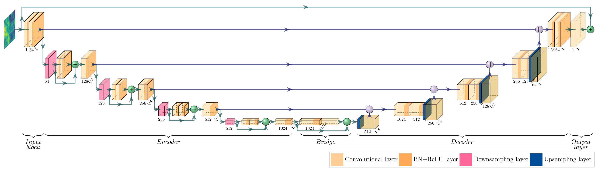
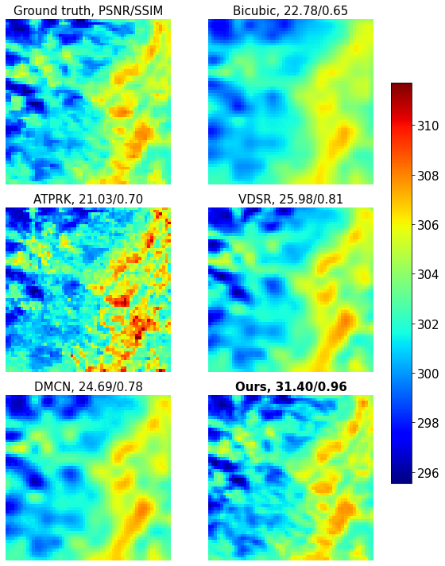

# Convolutional Neural Network Modelling for MODIS Land Surface Temperature Super-Resolution
This repository includes code implementation for the article:
> [*Binh Minh Nguyen, Ganglin Tian, Minh-Triet Vo, Aurélie Michel, Thomas Corpetti, et al.*. **Convolutional Neural Network Modelling for MODIS Land Surface Temperature Super-Resolution. 2022**.](https://hal.archives-ouvertes.fr/hal-03580148)

## 0. Requirements

```
pip install requirements.txt
```
<table>
<tr><th>Table 1 Heading 1 </th><th>Table 1 Heading 2</th></tr>
<tr><td>

|Table 1| Middle | Table 2|
|--|--|--|
|a| not b|and c |

</td><td>

|b|1|2|3| 
|--|--|--|--|
|a|s|d|f|

</td></tr> </table>
## 1. Data downloading and database preparation
User should firstly register on NASA's website[https://urs.earthdata.nasa.gov/users/new]. 
User could use the following command to download automatically MODIS dataset with the user name and corresponding password, the downloaded data will be placed folder "MODIS" in current directory.
```
python modis_downloader.py --username <username> --password <password> 
```

By assigning values to '--year_begin' and '--year_end', user can select the time range for downloading data, from year_begin to year_end. Default 'year_begin' is 2020, 'year_end' is 2021.
```
python modis_downloader.py --year_begin <year_begin> --year_end <year_end> --username <username> --password <password> 
```

After downloading the raw data for the desired years, data need to be pre-processed, which involves cropping, cloud and sea pixels elimination and downsampling:
```
python modis_data_preprocessing.py --year_begin <year_begin> --year_end <year_end>
```

## 2. Train and test **Multi residual U-net**

Our principle contribution in this project is to design and implement a new deep learning model based on U-net architecture called **Multi-residual U-net**. The architecture of this model is shown as below:



### Train
To train the network with your tif data, please make sure to put all of the data into a folder and run the following command:

```
python train.py --datapath <path/to/training/tifs/directory> --model_name <name of the model> --lr <learning rate> --epochs <number of epochs> --batch_size <size of batch> --continue_train <True/False>
```
*P/s: The checkpoint of training process lies in the same directory as the train.py*.

### Test
To run the inference of the pretrained network on your tif data, please make sure to put all of the data into a folder and run the following command:

```
python run_inference.py --datapath <path/to/testing/tifs/directory> --pretrained <path/to/pretrained/model.pth> --savepath <path/to/save/directory> --max_val <normalization factor>
```
*P/s:*
1. The max_val is the maximum pixel value of the data used for training the pretrained model.
2. A pretrained Multi-residual U-Net can be found in **Visualization benchmark**.

## 3. Result

To quantify the results, we employed some famous metrics in image super resolution: PSNR and SSIM. We also mentioned RMSE because it is meaningful in remote sensing.

Qualitative results:



Quantitative results:

| Method                     | PSNR    | SSIM | RMSE |
|:--------------------------:|:-------:|:----:|:----:|
|  Bicubic                   |  23.91  | 0.61 | 0.69 |
|  ATPRK                     |  21.59  | 0.61 | 0.90 |
|  VDSR                      |  25.42  | 0.72 | 0.58 |
|  DCMN                      |  25.05  | 0.71 | 0.61 |
|  **Multi-residual U-Net**  |  **28.40**  | **0.85** | **0.39** | **(ours)**

## 4. Result visualization

You can find the notebook as well as the instruction for the benchmarking visualization in the folder *Visualization benchmark*. The notebook provides functions to plot and benchmark several techniques mentioned in the paper.


