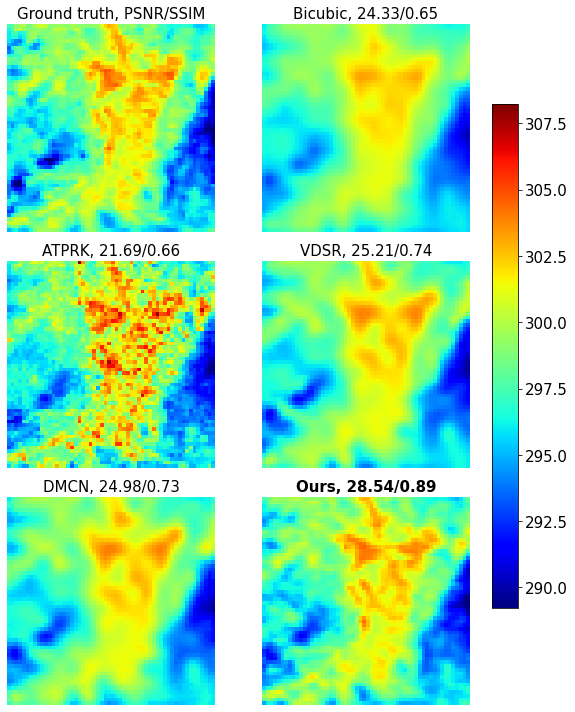

## Benchmark visualization

This folder provides the code to benchmark the methods mentioned in the paper.

<table>
<tr><th>File description </th></tr>
<tr><td>

| File name | Description |
|-----------|-------------|
|Thunmpy|folder containing codes for ATPRK statistical super-resolution, please refer to [this Github repo by @cgranerob and @aumichel](https://github.com/cgranerob/ThUnmpy)|
|ATPRK.py|ATPRK execution (to be deleted?)|
|Visualization_benchmark.ipynb|notebook for running the visualization|
|model.py and utils.py|(to be deleted?)|

</td></tr> </table>

## Requirement
Before running the notebook, you first need to download the pre-trained models and put them in this folder using the following links:

VDSR: [here](https://drive.google.com/file/d/17OKkTVxhD4GSuSArA9bJ6Uq8WkRe1Sb1/view?usp=sharing)

DMCN: [here](https://drive.google.com/file/d/12XNOszkNoZTM3aZPwu_LbdLd1HWESwL1/view?usp=sharing)

Multi-residual U-Net: [here](https://drive.google.com/file/d/1-BCc0-kj07p5FK4GbV_dzLb_0XEuKe6b/view?usp=sharing)

You also need to format your dataset into an npy array with the size: 
(data_length, 2, 64, 64).
Where data_length is the number of test data points. Each data points consists of two channels, index 0 represents NDVI and index 1 represents LST. Each channel has the size of 64 x 64 pixels.

The example dataset can be found [here](https://drive.google.com/file/d/1np-1OogR8q9coWb-wMdlsFk-Rk6h4ouD/view?usp=sharing).

You need to put your dataset into **dataset** folder.

## Run visualization

After doing previous steps, you can run the notebook visualization_benchmark.ipynb to see the results.

An example result:

